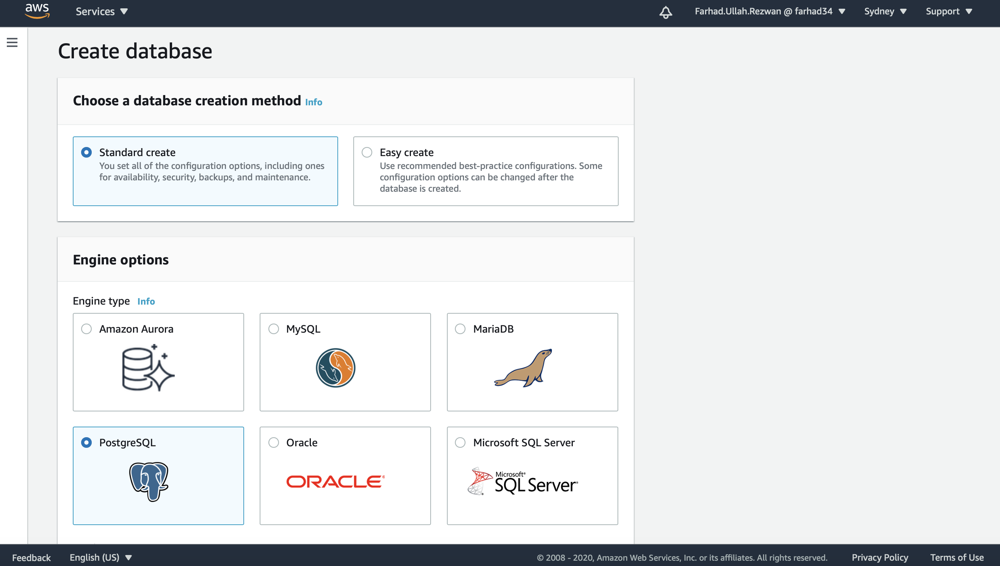
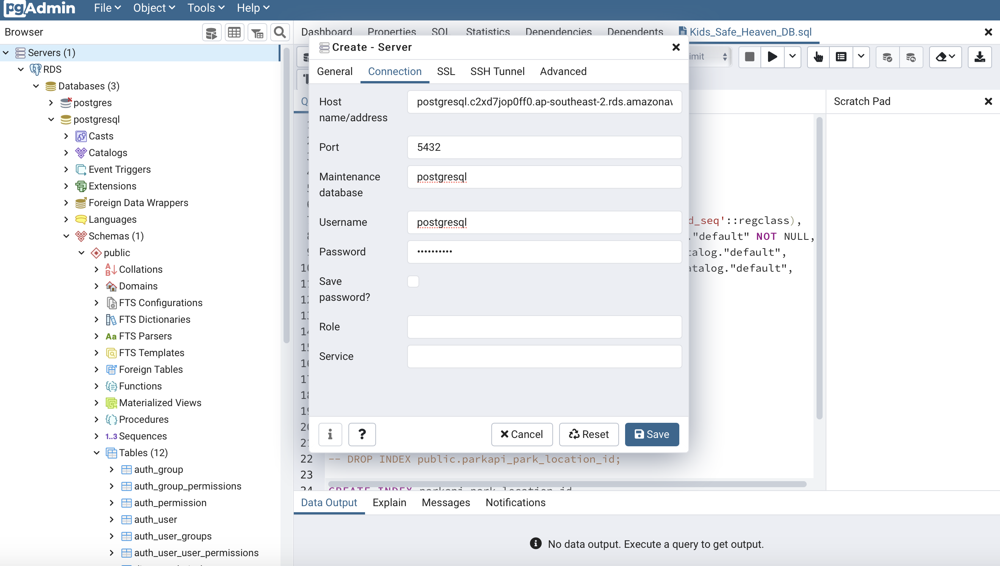
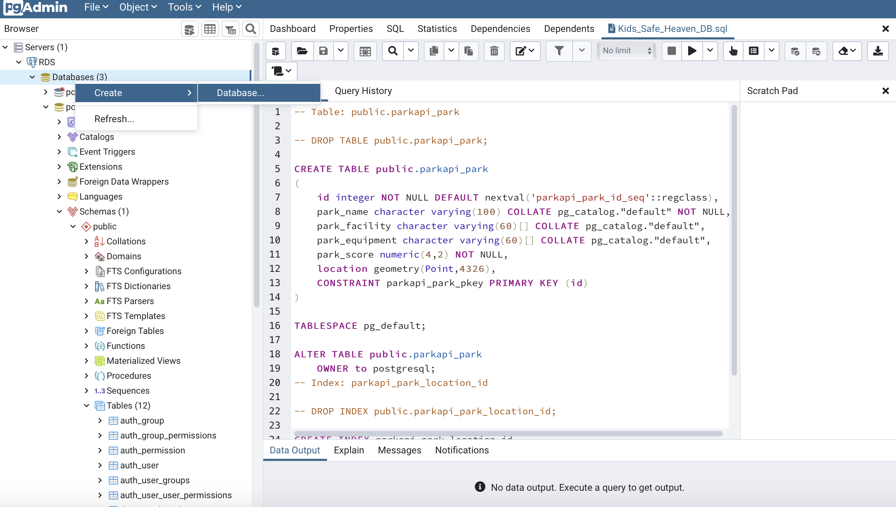
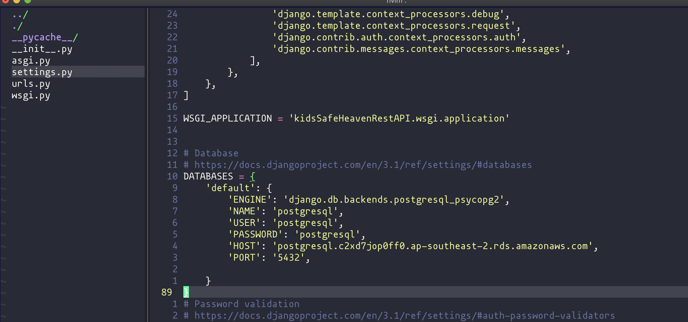

# 1. Creating and connecting the Database in RDS
    PostGRE Database can be created in the Amazon Management Console -> RDS -> Create Database -> select database (postgreSQL) -> other settings

# 2. Configuring the PostGRE application with RDS database endpoint(Optional) and create table with the schema.
    After the database creation is complete, the database can be configured and created using the schema that is attached in this directory and setting the configuration of the database in the pgAdmin4 console.

# 3. or, configure the django app with database configuration and deploy the app.

    In the backend the database configuration looks like this 

