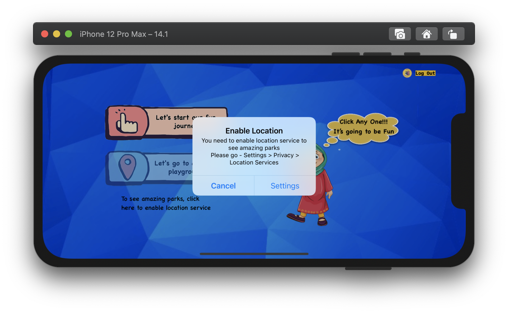
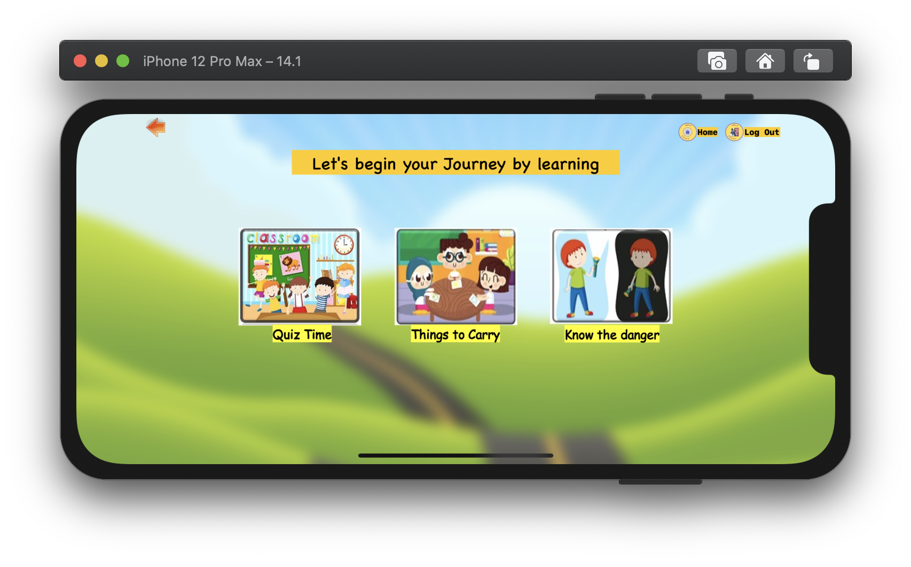

# Introduction
A large number of research reports show that more and more children are exposed to various dangers in playgrounds, such as supervision, improper use of equipment or improper play, etc. Safe children's play is a very concerning issue and needs to be addressed.

# Product Kids Safe Heaven

All playground equipment will be displayed in a virtual playground space, and each playground equipment is interactive. Children can click on any equipment to get instructions on how to use the equipment in the playground. Instructions include: mini game, video or simple challenge task. The iOS application game will not only enrich the children's gaming satisfactions, but also educate them about the safety of the playground equipment.

# Things in this package:
1. Kids Safe Heaven:
    - iOS Application XCode Package
2. newDjango:
    - Backend Server Codes: django
3. Recommended Park - Data Analysis and ML:
    - Recommended Park Scripts, Codes, and ipynb file: python, R
4. README.md and mdFileAssets:
    - md file and its accessories
5. .dotfile:
    - Work Environment / IDE settings

# Screens

## 1. Welcome Screen
### Sample Welcome Screen

## 2. Register Screens
### Sample Register Home Screen

### Sample Register Screens

### Sample Create User Screens

## 3. Home Screen
### Sample Home Screens

## 4. Journey Screen
### Sample Journey Screens

### 4.1 Quiz Home

#### Sample Quiz Question

#### Sample Quiz Answer - Right

#### Sample Quiz Answer - Wrong

#### Sample Quiz Scoreboard

### 4.2 Spot The Danger
#### Spot the Danger Screen

#### Spot The Danger Screen - Summary

### 4.3 Things to Carry
#### Things to Carry Screens

#### Things to Carry - Right

#### Things to Carry - Wrong

#### Things to Carry - Success

## 5. Recommended Park Screen
### Sample Recommended Parks Screens
#### Recommended Parks

#### Single Park

#### Equipment Tips Park

#### Video Tips Screen

## 6. Logout
### Sample Logout Alert

